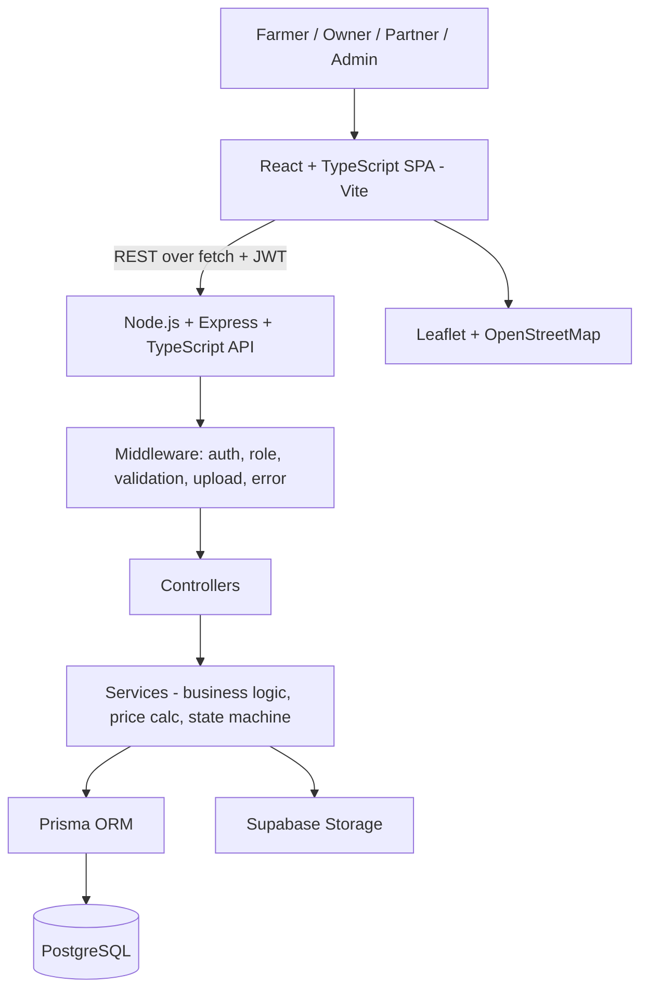

# ⚙️ TRD v3 — Beginner-Friendly Agriculture Equipment Rental Platform

**Version** - 3.0 (revised from v2 — same architecture, reorganized around a 13-milestone beginner learning path)
**Companion** - `PRD-Agriculture-Rental-Platform-v3.md`
**Reader** - You: B.Tech CSE (AI/ML) fresher, know technology names/purposes, limited hands-on practice. Strong fundamentals-to-learn in HTML/CSS/JS/React/HTTP/Node/Express/SQL/PostgreSQL/Auth/Git; not yet strong in TypeScript, Tailwind, RHF, Zod, TanStack Query, Prisma, JWT implementation, Leaflet.
**Legend** - **(Proposed)** = assumption. **[CORE]/[SECONDARY]/[FUTURE]** = matches PRD v3 §20.
**What changed from v2** - Same stack, same schema, same API shape, same state machine. New: §§1–5 (stack/order/mandatory-optional/exclusions), the 7-level learning framework (§3), the "why / prerequisite / where it's used / what you'll build / interview-ready" breakdown for every technology (§9), a 13-milestone plan with AI-assistance rules and resume/interview checklists per milestone (§12), and consolidated resume-readiness (§13) and interview-readiness (§14) sections. No technology was added or removed versus v2 — only sequenced and explained.

---

## 1. Final Technology Stack

Identical to v2 — nothing added, nothing removed:

| Layer | Technology |
|---|---|
| Frontend framework | React + TypeScript (Vite) |
| Routing | React Router |
| Styling | Tailwind CSS |
| Data fetching | `fetch` |
| Forms | React Hook Form |
| Schema validation | Zod |
| Server-state cache | TanStack Query |
| Maps | Leaflet + OpenStreetMap |
| Backend runtime | Node.js + Express + TypeScript |
| Validation (backend) | Zod |
| Auth | JWT |
| Password hashing | bcrypt (or Argon2) |
| ORM | Prisma |
| Database | PostgreSQL |
| File storage | Supabase Storage |
| API testing | Postman |
| Version control | Git + GitHub |
| Editor | VS Code |
| Frontend hosting | Vercel |
| Backend hosting | Render or Railway |
| DB hosting | Managed PostgreSQL |

---

## 2. Why Each Technology Is Used

| Technology | Why it's in this project (not "because it's popular") |
|---|---|
| **HTML** | Structure of every page; required before anything else makes sense |
| **CSS** | Layout and styling; required to understand what Tailwind is a shortcut *for* |
| **JavaScript** | The language React, Node, and all logic is written in |
| **React** | Industry-standard way to build the UI as reusable components; heavily asked about in fresher interviews |
| **TypeScript** | Catches bugs before running the code; almost every serious React/Node job posting lists it |
| **React Router** | The app has many pages (search, details, booking, dashboards) — needs client-side navigation |
| **Tailwind CSS** | Fast, consistent styling once you already understand CSS — not a replacement for learning CSS |
| **fetch** | Native browser API for talking to the backend — no extra library needed to learn HTTP |
| **React Hook Form** | Booking/listing/review forms have several fields; manual `useState` per field gets messy fast — RHF is the standard solution |
| **Zod** | One schema, reused for both form validation (frontend) and request validation (backend) — teaches "single source of truth" |
| **TanStack Query** | Once there's real server data (not mock data), you need caching, loading/error states, and refetching — this is the standard tool for that |
| **Node.js + Express** | Backend runtime and the most common minimal Node web framework — asked about constantly in interviews |
| **SQL / PostgreSQL** | The project has real relationships (users, equipment, bookings) — a relational database is the correct tool, and SQL is a fundamental interview topic |
| **Prisma** | Removes repetitive SQL boilerplate once you already understand what the SQL underneath is doing |
| **JWT** | Stateless authentication that works cleanly with a separate frontend and backend |
| **bcrypt/Argon2** | Passwords must never be stored in plain text — this is a baseline security requirement, not optional |
| **Supabase Storage** | Equipment/condition photos are files, not rows — object storage is the correct tool, not the database |
| **Leaflet + OpenStreetMap** | Free, no API key, and teaches raw map integration instead of hiding it behind a paid SDK |
| **Postman** | Lets you test backend endpoints before the frontend exists — critical for debugging in isolation |
| **Git/GitHub** | Version control and the way every real engineering team works together |
| **Vercel / Render/Railway** | Free-tier hosting that gets the project to a real, shareable, deployed URL |

---

## 3. Beginner Learning Order — 7 Levels

This is the master ordering. Every milestone in §12 belongs to exactly one level, and nothing from a later level is used before its level is reached.

| Level | Contains | Why this position |
|---|---|---|
| **Level 1 — Fundamentals** | HTML, CSS, JavaScript, Git/GitHub | Everything else is built on these; skipping them means copying React/Node code without understanding it |
| **Level 2 — Frontend framework** | React, React Router, TypeScript, Tailwind CSS | You need HTML/CSS/JS solid before components make sense; TypeScript is introduced once you're comfortable writing plain JS components; Tailwind after plain CSS |
| **Level 3 — API integration** | HTTP, REST, JSON, `fetch`, API error handling, Postman | Bridges frontend and backend — needed to understand *why* a backend is being built next |
| **Level 4 — Backend** | Node.js, Express, routes, controllers, services, middleware, error handling | Mirrors what you just learned as a client (Level 3), now from the server side |
| **Level 5 — Database** | SQL, PostgreSQL, relationships, CRUD, JOINs, Prisma | Raw SQL first so Prisma isn't "magic" — Prisma is introduced only after you can write the same query by hand |
| **Level 6 — Authentication** | Password hashing, JWT, authentication, authorization, RBAC, protected routes | Needs Level 4 (middleware) and Level 5 (users table) already in place |
| **Level 7 — Additional project technologies** | React Hook Form, Zod, TanStack Query, Supabase Storage, Leaflet + OpenStreetMap, Deployment | Only added once the core app already works end-to-end — these make the app *better*, not *possible* |

**Adjustment from the requested order, with reason** - Your original list put "Git/GitHub" in Level 1 and "Deployment" in Level 7 — kept exactly that way. The one deliberate re-sequencing versus a literal reading of your milestone sketch: **raw SQL (Level 5) is taught and used in the backend before Prisma is introduced**, even though Prisma appears alongside SQL in your own "Level 5" bullets. Reason: you explicitly said *"I must still learn SQL and understand the actual database queries instead of blindly relying on Prisma"* — so M7 (SQL, no ORM) comes before M8 (Prisma), even though both are "Level 5" technologies.

---

## 4. Mandatory vs Optional

| Status | Technologies | Meaning |
|---|---|---|
| **Mandatory for a working V1 (CORE, PRD §20)** | HTML, CSS, JS, React, TypeScript, React Router, Node.js, Express, SQL, PostgreSQL, Prisma, JWT, bcrypt, Git/GitHub, Postman | Without these, the CORE rental loop does not exist |
| **Mandatory once you reach Level 7 (SECONDARY, PRD §20)** | Tailwind, React Hook Form, Zod, TanStack Query, Supabase Storage, Leaflet | Needed for the *polished/full* V1, not for the first working version |
| **Optional / your choice** | Argon2 vs bcrypt (default: bcrypt, simpler setup); Render vs Railway for backend hosting | Two valid choices, pick one and move on |
| **Never in V1** | Everything in §5 | Explicitly excluded |

---

## 5. What Is NOT Included

Unchanged from v2:

- **No** Redux, Next.js, Angular, Vue
- **No** MongoDB, Redis, GraphQL
- **No** microservices, Kubernetes
- **No** Docker (unless a genuine, specific need appears later — none identified for V1)
- **No** Socket.IO / realtime in V1
- **No** payment gateway in V1
- **No** live GPS tracking in V1
- **No** AI features before the core app works (Level 7 complete)

If you ever feel tempted to add one of these "because it looks good on a resume," §13's rule solves that: a technology only goes on the resume once it's actually been used and can be explained — adding unused technologies for the resume defeats the purpose.

---

## 6. Complete Architecture

Unchanged from v2 — same modular monolith:



- **One frontend app, one backend app, one database.**
- **Flow** - `React → fetch → Express routes → middleware → controller → service → Prisma → PostgreSQL`.
- **No realtime layer** - status changes are read by re-fetching, not pushed.
- **This diagram is the answer to "walk me through your architecture" in an interview** — you should be able to redraw it from memory by M11 (interview question repeated in §14).

---

## 7. Database Architecture — Beginner-Explained

Same schema as v2, explained table by table in plain language, with example rows.

### 7.1 Entity relationships in plain language

- **A User owns many Equipment** (only if role = OWNER).
- **A User creates many Bookings** (only if role = FARMER).
- **An Equipment has many Bookings** over time (not at the same time — that's the availability rule).
- **A Booking has one Agreement acceptance.**
- **A Booking has many Status Events** (its history — a row per status change).
- **A Booking has zero or one Delivery Assignment** (only if handover = logistics).
- **A Booking has zero, one or two Condition Reports** (before/after — Level 7).
- **A Booking has zero or one Damage Report** (Level 7).
- **A Booking has zero, one or two Reviews** (one for equipment, one for owner).

### 7.2 Tables (CORE tables first)

#### `users` — **CORE**
- **Purpose** - Every person who can log in: Farmer, Owner, Delivery Partner, Admin.
- **Primary key** - `id` (UUID).
- **Columns**

| Column | Type | Notes |
|---|---|---|
| id | UUID | primary key |
| name | TEXT | |
| email | TEXT (unique) | login credential |
| phone | TEXT (unique) | login credential |
| password_hash | TEXT | never store the raw password |
| role | ENUM | FARMER / OWNER / DELIVERY_PARTNER / ADMIN |
| status | ENUM | ACTIVE / SUSPENDED |
| created_at | TIMESTAMP | |

- **Example record**

| id | name | email | role | status |
|---|---|---|---|---|
| u1 | Ramesh Reddy | ramesh@example.com | OWNER | ACTIVE |
| u2 | Saipriya P. | saipriya@example.com | FARMER | ACTIVE |

#### `equipment` — **CORE**
- **Purpose** - One row per item an Owner lists for rent.
- **Primary key** - `id`. **Foreign key** - `owner_id → users.id`.
- **Columns** - `id, owner_id, name, category, brand, model, description, price_per_day, status, created_at`
- **Example record**

| id | owner_id | name | category | price_per_day | status |
|---|---|---|---|---|---|
| e1 | u1 | John Deere 5310 | Tractor | 2500.00 | ACTIVE |

#### `equipment_location` — **CORE (text address only until Level 7)**
- **Purpose** - Where to pick the equipment up.
- **Primary key / Foreign key** - `equipment_id` (also the FK to `equipment.id` — one row per equipment).
- **Columns** - `equipment_id, address, latitude, longitude`
- **Beginner note** - In CORE you only fill `address` (plain text). `latitude`/`longitude` become meaningful once Leaflet (Level 7) is added.

#### `availability_windows` — **CORE**
- **Purpose** - Date ranges the Owner is willing to rent the equipment out.
- **Primary key** - `id`. **Foreign key** - `equipment_id → equipment.id`.
- **Columns** - `id, equipment_id, start_date, end_date`
- **Example record**

| id | equipment_id | start_date | end_date |
|---|---|---|---|
| a1 | e1 | 2026-10-15 | 2026-10-25 |

#### `bookings` — **CORE**
- **Purpose** - One row per rental request, from PENDING all the way to COMPLETED.
- **Primary key** - `id`. **Foreign keys** - `equipment_id → equipment.id`, `farmer_id → users.id`.
- **Columns** - `id, equipment_id, farmer_id, start_date, end_date, total_days, total_amount, handover_method, status, rejection_reason, created_at`
- **Example record**

| id | equipment_id | farmer_id | start_date | end_date | total_days | total_amount | status |
|---|---|---|---|---|---|---|---|
| b1 | e1 | u2 | 2026-10-16 | 2026-10-18 | 3 | 7500.00 | PENDING |

#### `agreement_acceptances` — **CORE**
- **Purpose** - Proof the Farmer accepted the rental terms for this booking.
- **Primary key / Foreign key** - `booking_id` (1-to-1 with `bookings.id`).
- **Columns** - `booking_id, agreement_version, accepted_by, accepted_at`

#### `status_events` — **CORE**
- **Purpose** - The full history of a booking's status changes (this is what powers the timeline UI).
- **Primary key** - `id`. **Foreign key** - `booking_id → bookings.id`.
- **Columns** - `id, booking_id, status, changed_by, note, created_at`
- **Beginner note** - `bookings.status` is the *current* status (fast to read); `status_events` is the *history* (one row is added every time the status changes). This is a common real-world pattern called an "audit trail" — good interview talking point.

### 7.3 Tables added at Level 6 (Authentication milestone)
No new tables — `users.password_hash` and `users.role` (already in §7.2) are what M10 works with.

### 7.4 Tables added at Level 7 (SECONDARY features, M12)

#### `equipment_images` — **SECONDARY**
- **Purpose** - Photo URLs for a listing (files live in Supabase Storage; only the URL is stored here).
- **Columns** - `id, equipment_id, image_url, is_primary, created_at`

#### `delivery_locations` — **SECONDARY**
- **Purpose** - Where the Farmer wants the equipment delivered (owner delivery / logistics only).
- **Columns** - `booking_id, address, latitude, longitude`

#### `delivery_assignments` — **SECONDARY**
- **Purpose** - Which simulated Delivery Partner is handling this booking.
- **Columns** - `booking_id, partner_id, assigned_by, assigned_at`

#### `condition_reports` + `condition_report_images` — **SECONDARY**
- **Purpose** - Before/after photo evidence of equipment condition.
- **Columns** - `id, booking_id, stage (PRE_HANDOVER/POST_RETURN), notes, submitted_by, created_at` (+ image table with `image_url`)

#### `damage_reports` + `damage_report_images` — **SECONDARY**
- **Purpose** - A reported problem, which opens a dispute.
- **Columns** - `id, booking_id, reported_by, description, resolved, resolution_note, resolved_by, created_at, resolved_at` (+ image table)

#### `reviews` — **CORE (simple version, no images)**
- **Purpose** - Star rating + comment, for equipment or for the owner.
- **Columns** - `id, booking_id, reviewer_id, target_type (EQUIPMENT/OWNER), target_id, rating (1-5), comment, created_at`

#### `notifications` — **SECONDARY**
- **Purpose** - In-app alerts.
- **Columns** - `id, user_id, type, message, booking_id, read_at, created_at`

### 7.5 Full SQL (reference — same as v2)

```sql
-- Enums
CREATE TYPE user_role AS ENUM ('FARMER','OWNER','DELIVERY_PARTNER','ADMIN');
CREATE TYPE user_status AS ENUM ('ACTIVE','SUSPENDED');
CREATE TYPE equipment_status AS ENUM ('ACTIVE','INACTIVE');
CREATE TYPE handover_method AS ENUM ('FARMER_PICKUP','OWNER_DELIVERY','LOGISTICS_PARTNER');
CREATE TYPE booking_status AS ENUM (
  'PENDING','REJECTED','CANCELLED','CONFIRMED','READY_FOR_HANDOVER',
  'PICKED_UP','IN_TRANSIT','ARRIVING','DELIVERED','ACTIVE',
  'RETURN_REQUESTED','RETURNED','COMPLETED','DISPUTED'
);
CREATE TYPE condition_stage AS ENUM ('PRE_HANDOVER','POST_RETURN');
CREATE TYPE review_target AS ENUM ('EQUIPMENT','OWNER');
CREATE TYPE notification_type AS ENUM (
  'BOOKING_REQUESTED','BOOKING_CONFIRMED','BOOKING_REJECTED','BOOKING_CANCELLED',
  'HANDOVER_UPDATE','PARTNER_ASSIGNED','RETURN_REQUESTED','RETURN_RECEIVED',
  'BOOKING_COMPLETED','DISPUTE_OPENED','DISPUTE_RESOLVED','REVIEW_RECEIVED'
);

CREATE TABLE users (
  id UUID PRIMARY KEY DEFAULT gen_random_uuid(),
  name TEXT NOT NULL, email CITEXT UNIQUE NOT NULL, phone TEXT UNIQUE NOT NULL,
  password_hash TEXT NOT NULL, role user_role NOT NULL, status user_status NOT NULL DEFAULT 'ACTIVE',
  created_at TIMESTAMPTZ NOT NULL DEFAULT now(), updated_at TIMESTAMPTZ NOT NULL DEFAULT now()
);

CREATE TABLE equipment (
  id UUID PRIMARY KEY DEFAULT gen_random_uuid(), owner_id UUID NOT NULL REFERENCES users(id),
  name TEXT NOT NULL, category TEXT NOT NULL, brand TEXT, model TEXT, description TEXT,
  price_per_day NUMERIC(10,2) NOT NULL CHECK (price_per_day > 0),
  status equipment_status NOT NULL DEFAULT 'ACTIVE',
  created_at TIMESTAMPTZ NOT NULL DEFAULT now(), updated_at TIMESTAMPTZ NOT NULL DEFAULT now()
);

CREATE TABLE equipment_images (
  id UUID PRIMARY KEY DEFAULT gen_random_uuid(), equipment_id UUID NOT NULL REFERENCES equipment(id) ON DELETE CASCADE,
  image_url TEXT NOT NULL, is_primary BOOLEAN NOT NULL DEFAULT false, created_at TIMESTAMPTZ NOT NULL DEFAULT now()
);

CREATE TABLE equipment_location (
  equipment_id UUID PRIMARY KEY REFERENCES equipment(id) ON DELETE CASCADE,
  address TEXT NOT NULL, latitude DOUBLE PRECISION NOT NULL, longitude DOUBLE PRECISION NOT NULL
);

CREATE TABLE availability_windows (
  id UUID PRIMARY KEY DEFAULT gen_random_uuid(), equipment_id UUID NOT NULL REFERENCES equipment(id) ON DELETE CASCADE,
  start_date DATE NOT NULL, end_date DATE NOT NULL CHECK (end_date >= start_date)
);

CREATE EXTENSION IF NOT EXISTS btree_gist;

CREATE TABLE bookings (
  id UUID PRIMARY KEY DEFAULT gen_random_uuid(), equipment_id UUID NOT NULL REFERENCES equipment(id),
  farmer_id UUID NOT NULL REFERENCES users(id), start_date DATE NOT NULL,
  end_date DATE NOT NULL CHECK (end_date >= start_date), total_days INT NOT NULL,
  total_amount NUMERIC(10,2) NOT NULL, handover_method handover_method NOT NULL,
  status booking_status NOT NULL DEFAULT 'PENDING', rejection_reason TEXT,
  created_at TIMESTAMPTZ NOT NULL DEFAULT now(), updated_at TIMESTAMPTZ NOT NULL DEFAULT now(),
  date_range DATERANGE GENERATED ALWAYS AS (daterange(start_date, end_date, '[]')) STORED
);

ALTER TABLE bookings
  ADD CONSTRAINT no_overlapping_reserved_bookings
  EXCLUDE USING gist (equipment_id WITH =, date_range WITH &&)
  WHERE (status IN ('CONFIRMED','READY_FOR_HANDOVER','PICKED_UP','IN_TRANSIT',
                     'ARRIVING','DELIVERED','ACTIVE','RETURN_REQUESTED','RETURNED'));

CREATE TABLE agreement_acceptances (
  booking_id UUID PRIMARY KEY REFERENCES bookings(id) ON DELETE CASCADE,
  agreement_version TEXT NOT NULL, accepted_by UUID NOT NULL REFERENCES users(id),
  accepted_at TIMESTAMPTZ NOT NULL DEFAULT now()
);

CREATE TABLE status_events (
  id UUID PRIMARY KEY DEFAULT gen_random_uuid(), booking_id UUID NOT NULL REFERENCES bookings(id) ON DELETE CASCADE,
  status booking_status NOT NULL, changed_by UUID NOT NULL REFERENCES users(id),
  note TEXT, created_at TIMESTAMPTZ NOT NULL DEFAULT now()
);

CREATE TABLE delivery_locations (
  booking_id UUID PRIMARY KEY REFERENCES bookings(id) ON DELETE CASCADE,
  address TEXT NOT NULL, latitude DOUBLE PRECISION NOT NULL, longitude DOUBLE PRECISION NOT NULL
);

CREATE TABLE delivery_assignments (
  booking_id UUID PRIMARY KEY REFERENCES bookings(id) ON DELETE CASCADE,
  partner_id UUID NOT NULL REFERENCES users(id), assigned_by UUID NOT NULL REFERENCES users(id),
  assigned_at TIMESTAMPTZ NOT NULL DEFAULT now()
);

CREATE TABLE condition_reports (
  id UUID PRIMARY KEY DEFAULT gen_random_uuid(), booking_id UUID NOT NULL REFERENCES bookings(id) ON DELETE CASCADE,
  stage condition_stage NOT NULL, notes TEXT, submitted_by UUID NOT NULL REFERENCES users(id),
  created_at TIMESTAMPTZ NOT NULL DEFAULT now(), UNIQUE (booking_id, stage)
);

CREATE TABLE condition_report_images (
  id UUID PRIMARY KEY DEFAULT gen_random_uuid(),
  condition_report_id UUID NOT NULL REFERENCES condition_reports(id) ON DELETE CASCADE, image_url TEXT NOT NULL
);

CREATE TABLE damage_reports (
  id UUID PRIMARY KEY DEFAULT gen_random_uuid(), booking_id UUID NOT NULL REFERENCES bookings(id) ON DELETE CASCADE,
  reported_by UUID NOT NULL REFERENCES users(id), description TEXT NOT NULL,
  resolved BOOLEAN NOT NULL DEFAULT false, resolution_note TEXT, resolved_by UUID REFERENCES users(id),
  created_at TIMESTAMPTZ NOT NULL DEFAULT now(), resolved_at TIMESTAMPTZ
);

CREATE TABLE damage_report_images (
  id UUID PRIMARY KEY DEFAULT gen_random_uuid(),
  damage_report_id UUID NOT NULL REFERENCES damage_reports(id) ON DELETE CASCADE, image_url TEXT NOT NULL
);

CREATE TABLE reviews (
  id UUID PRIMARY KEY DEFAULT gen_random_uuid(), booking_id UUID NOT NULL REFERENCES bookings(id) ON DELETE CASCADE,
  reviewer_id UUID NOT NULL REFERENCES users(id), target_type review_target NOT NULL, target_id UUID NOT NULL,
  rating SMALLINT NOT NULL CHECK (rating BETWEEN 1 AND 5), comment TEXT,
  created_at TIMESTAMPTZ NOT NULL DEFAULT now(), UNIQUE (booking_id, target_type)
);

CREATE TABLE notifications (
  id UUID PRIMARY KEY DEFAULT gen_random_uuid(), user_id UUID NOT NULL REFERENCES users(id),
  type notification_type NOT NULL, message TEXT NOT NULL, booking_id UUID REFERENCES bookings(id),
  read_at TIMESTAMPTZ, created_at TIMESTAMPTZ NOT NULL DEFAULT now()
);
```

### 7.6 Prisma (Level 5, after SQL)
- Introduced only in M8, **after** M7 has you writing and running the SQL above by hand (via `psql` or a GUI).
- One `schema.prisma` mirroring every table above 1:1, with `@@map` to keep the snake_case SQL table names.
- The exclusion constraint (double-booking prevention) is **not expressible in Prisma's schema language** — you'll add it with a manual SQL migration (`prisma migrate dev --create-only`, hand-edit, then apply). This is a good, honest interview point: *"Prisma can't express everything — I had to drop to raw SQL for the exclusion constraint."*

---

## 8. API Architecture — Learning-Friendly

### 8.1 The full request lifecycle (learn this once, it repeats for every endpoint)

```text
React form
   ↓
fetch()
   ↓
HTTP request (method + URL + headers + body)
   ↓
Express route (matches method + path)
   ↓
auth middleware        (is there a valid JWT? who is the user?)
   ↓
role middleware         (is this user's role allowed here?)
   ↓
validation middleware   (does the request body match the Zod schema?)
   ↓
controller              (reads req, calls the service, shapes the response)
   ↓
service                 (business logic: e.g. is this equipment actually available?)
   ↓
Prisma                  (typed query)
   ↓
PostgreSQL               (the actual data)
   ↓
response (JSON + status code)
   ↓
React UI updates
```

Draw this from memory before M9 (integration milestone) — it's asked about directly in §14.

### 8.2 Full endpoint reference

Every endpoint below lists: method, path, purpose, auth?, role, request, response, errors, tables touched.

#### Auth
| | |
|---|---|
| **POST** `/api/auth/register` | **Purpose** - create a Farmer or Owner account. **Auth** - none. **Role** - n/a (body picks FARMER/OWNER). **Body** - `{name, email, phone, password, role}`. **Success** - `201 {user, token}`. **Errors** - `400` invalid input, `409` email/phone already used. **Tables** - `users`. |
| **POST** `/api/auth/login` | **Purpose** - log in. **Auth** - none. **Body** - `{email or phone, password}`. **Success** - `200 {user, token}`. **Errors** - `401` wrong credentials. **Tables** - `users`. |
| **POST** `/api/auth/logout` | **Purpose** - end session (client discards the token; no DB write in V1). **Auth** - required. **Success** - `200`. |
| **GET** `/api/auth/me` | **Purpose** - who am I. **Auth** - required. **Success** - `200 {user}`. **Errors** - `401` no/expired token. **Tables** - `users`. |

#### Equipment
| | |
|---|---|
| **GET** `/api/equipment` | **Purpose** - search/filter. **Auth** - none. **Query params** - `q, category, minPrice, maxPrice, startDate, endDate, page`. **Success** - `200 {items, total, page}`. **Tables** - `equipment`, `equipment_location`, `availability_windows`. |
| **GET** `/api/equipment/:id` | **Purpose** - details page. **Auth** - none. **Success** - `200 {equipment}`. **Errors** - `404`. **Tables** - `equipment` + related. |
| **POST** `/api/equipment` | **Purpose** - create a listing. **Auth** - required. **Role** - OWNER. **Body** - `{name, category, brand, model, description, pricePerDay, address}`. **Success** - `201 {equipment}`. **Errors** - `400` validation, `403` not an Owner. **Tables** - `equipment`, `equipment_location`. |
| **PUT** `/api/equipment/:id` | **Purpose** - edit. **Auth** - required. **Role** - OWNER (own only). **Errors** - `403` not the owner, `404`. |
| **DELETE** `/api/equipment/:id` | **Purpose** - remove. **Auth** - required. **Role** - OWNER (own) or ADMIN. |
| **PUT** `/api/equipment/:id/availability` | **Purpose** - replace availability windows. **Auth** - OWNER (own). **Body** - `{windows: [{startDate, endDate}]}`. **Tables** - `availability_windows`. |

#### Bookings
| | |
|---|---|
| **POST** `/api/bookings/quote` | **Purpose** - price preview, no write. **Auth** - FARMER. **Body** - `{equipmentId, startDate, endDate}`. **Success** - `200 {totalDays, totalAmount}`. **Tables** - read-only `equipment`. |
| **POST** `/api/bookings` | **Purpose** - create a booking request. **Auth** - FARMER. **Body** - `{equipmentId, startDate, endDate, handoverMethod, agreementAccepted: true}`. **Success** - `201 {booking}`. **Errors** - `400` agreement not accepted, `409` dates unavailable. **Tables** - `bookings`, `agreement_acceptances`, `status_events`. |
| **GET** `/api/bookings/my` | **Purpose** - own bookings list. **Auth** - FARMER or OWNER (scoped to their own). **Tables** - `bookings`. |
| **GET** `/api/bookings/:id` | **Purpose** - detail. **Auth** - participant or ADMIN. **Errors** - `403` not a participant. |
| **PATCH** `/api/bookings/:id/confirm` | **Purpose** - Owner accepts. **Auth** - OWNER (own equipment). **Errors** - `409` invalid state or dates now unavailable. **Tables** - `bookings`, `status_events`. |
| **PATCH** `/api/bookings/:id/reject` | **Purpose** - Owner declines. **Body** - `{reason}`. **Auth** - OWNER (own equipment). |
| **PATCH** `/api/bookings/:id/cancel` | **Purpose** - Farmer/Owner cancels before handover. **Auth** - participant. **Errors** - `409` already past that stage. |
| **PATCH** `/api/bookings/:id/status` | **Purpose** - generic transition (ready/picked-up/active/return/returned/complete). **Auth** - role + relation dependent (state machine, §12 M11). **Errors** - `409 INVALID_STATUS_TRANSITION`. **Tables** - `bookings`, `status_events`. |
| **GET** `/api/bookings/:id/timeline` | **Purpose** - status history. **Auth** - participant/ADMIN. **Tables** - `status_events`. |

#### Reviews
| | |
|---|---|
| **POST** `/api/bookings/:id/reviews` | **Purpose** - rate equipment/owner. **Auth** - FARMER, booking is COMPLETED. **Body** - `{targetType, rating, comment}`. **Errors** - `409` booking not completed or already reviewed. **Tables** - `reviews`. |
| **GET** `/api/equipment/:id/reviews` | **Purpose** - show reviews + average. **Auth** - none. |

#### Level 7 / SECONDARY endpoints
Image upload, delivery/location, condition/damage, notifications, admin — same endpoint shapes as v2 TRD §9.5–§9.9; built in M12.

### 8.3 Standard error format (learn once, applies to every endpoint)
```json
{ "error": { "code": "BOOKING_DATES_UNAVAILABLE", "message": "These dates are already booked.", "details": null } }
```
**Status codes to know cold** - `400` bad input, `401` not logged in, `403` logged in but not allowed, `404` doesn't exist, `409` conflicts with current state, `500` server bug.

---

## 9. Technology Deep-Dives (why / prerequisites / where / what / interview-ready)

Following the exact template you gave for React, applied to every major technology.

### React
- **Before React** - HTML basics, CSS basics, JS fundamentals (arrays/objects, functions, DOM/events).
- **Then React** - Components, JSX, props, state, events, forms, `useState`, `useEffect`, API integration.
- **Project usage** - Equipment listing, equipment details, booking forms, dashboards, auth UI.
- **Interview-ready** - Explain a component; props vs state; `useState`/`useEffect`; API integration; conditional rendering; reusable components.

### TypeScript
- **Before TS** - Comfortable writing and reading plain JavaScript React components.
- **Then TS** - `interface`/`type`, typing props, typing `useState`, typing API responses, basic generics (`useState<Booking[]>`).
- **Project usage** - Every component and every API function has typed inputs/outputs; shared `types/` folder mirrors backend shapes.
- **Interview-ready** - Why TypeScript over plain JS; `interface` vs `type`; how TS catches bugs at compile time; what a generic is (basic level).

### React Router
- **Before** - Understand what a "page" and a "URL" are; basic React components.
- **Then** - `<Routes>`, `<Route>`, `useParams`, `useNavigate`, protected routes (a wrapper component that checks auth before rendering).
- **Project usage** - `/equipment/:id`, `/bookings/:id`, role-gated dashboard routes.
- **Interview-ready** - How client-side routing differs from full page reloads; route params; protecting a route by role.

### Tailwind CSS
- **Before** - Solid plain CSS: box model, flexbox, selectors, responsive units.
- **Then** - Utility classes, responsive prefixes (`md:`, `sm:`), the small config file.
- **Project usage** - Restyle the M1 static pages and everything after, once introduced in M5.
- **Interview-ready** - What a utility-class framework trades off vs. writing custom CSS; when you'd still write plain CSS.

### HTTP / REST / fetch
- **Before** - Basic JS functions, promises/async-await, JSON.
- **Then** - HTTP methods and what each means, status codes, headers (`Authorization`, `Content-Type`), `fetch` syntax, handling loading/error/success in the UI.
- **Project usage** - Every API call in the app, starting M9.
- **Interview-ready** - GET vs POST vs PUT vs PATCH vs DELETE; what REST means; how you handle a failed fetch.

### React Hook Form + Zod
- **Before** - Controlled inputs with plain `useState` (built in M1–M3 by hand, so you feel the pain RHF solves).
- **Then** - `useForm`, `register`, `handleSubmit`, `zodResolver`, sharing one Zod schema between frontend and backend.
- **Project usage** - Register/login, create/edit listing, booking form, review form.
- **Interview-ready** - Why a form library over manual `useState` per field; what a schema validator buys you; where validation should live (both, client for UX + server as source of truth).

### TanStack Query
- **Before** - Plain `fetch` + `useState` + `useEffect` data loading (built by hand in M9, so the pain point — manual loading/error/refetch state — is felt first).
- **Then** - `useQuery`, `useMutation`, query keys, cache invalidation.
- **Project usage** - Equipment search/list, booking list, status timeline (polling).
- **Interview-ready** - What problem it solves vs. manual `useEffect` fetching; what a query key is; why you invalidate a query after a mutation.

### Node.js + Express
- **Before** - JS fundamentals; understanding what a server is (a program that listens for requests and responds).
- **Then** - Creating an app, defining routes, `req`/`res`, middleware chain, `next()`.
- **Project usage** - The entire backend.
- **Interview-ready** - What middleware is and how the chain works; how a route matches a request; sync vs async handlers.

### Middleware
- **Before** - Basic Express routes working.
- **Then** - Auth middleware (verify JWT), role middleware (check `req.user.role`), validation middleware (Zod), error-handling middleware (catches thrown errors centrally).
- **Project usage** - Every protected endpoint.
- **Interview-ready** - Draw the middleware chain for `POST /api/equipment`; explain why validation happens before the controller.

### SQL / PostgreSQL
- **Before** - Understanding what a table, row, and column are.
- **Then** - `SELECT/INSERT/UPDATE/DELETE`, `WHERE`, `JOIN`, primary/foreign keys, basic indexes, what a transaction is.
- **Project usage** - M7 — write and run the raw SQL in §7.5 by hand before Prisma exists.
- **Interview-ready** - Primary vs foreign key; INNER vs LEFT JOIN; what normalization means; why an index speeds up a query.

### Prisma
- **Before** - Comfortable writing the equivalent raw SQL yourself.
- **Then** - `schema.prisma`, `prisma migrate`, the generated client, basic queries (`findMany`, `create`, `update` with `where`/`include`).
- **Project usage** - Replaces the raw `pg` queries from M7 in every service function, starting M8.
- **Interview-ready** - What an ORM is and its trade-offs; how a Prisma migration works; when you'd still write raw SQL (e.g. the exclusion constraint, §7.6).

### Authentication (bcrypt + JWT)
- **Before** - Middleware and a working `users` table.
- **Then** - Why passwords are hashed not encrypted, `bcrypt.hash`/`bcrypt.compare`, what's inside a JWT (header/payload/signature), signing and verifying, where the token lives on the client.
- **Project usage** - Register, login, every protected route.
- **Interview-ready** - Authentication vs authorization; why hash instead of encrypt passwords; what's inside a JWT; how a protected route checks the token; what RBAC means.

### Supabase Storage
- **Before** - Backend file upload basics (multipart form data).
- **Then** - Upload a buffer to a bucket, get back a URL, store the URL (not the file) in Postgres.
- **Project usage** - Equipment images, condition/damage photos (M12).
- **Interview-ready** - Why files don't belong in a relational database; the upload → storage → URL → DB-row flow.

### Leaflet + OpenStreetMap
- **Before** - Basic React + a working location field in the form.
- **Then** - Rendering a map, placing a marker, a draggable pin, reading `lat`/`lng` back into form state.
- **Project usage** - Pickup/delivery location picker and display (M12).
- **Interview-ready** - Why OpenStreetMap tiles need no API key vs. Google Maps; how a Leaflet map is wired into a React component.

### Git / GitHub
- **Before** - Basic terminal usage.
- **Then** - `init/add/commit/push/pull`, branches, pull requests, `.gitignore`, resolving a simple merge conflict.
- **Project usage** - Every milestone is its own branch/PR (§12).
- **Interview-ready** - Explain your branching strategy; what a PR is for; how you'd resolve a conflict.

---

## 10. Frontend Architecture

### 10.1 Folder structure (same as v2, re-explained simply)
```text
client/
├── src/
│   ├── components/   shared UI pieces reused across pages (Button, Card, StatusTimeline)
│   ├── pages/        one folder per feature area (auth, equipment, booking, dashboards)
│   ├── services/api/ one file per resource — the ONLY place fetch() calls live
│   ├── hooks/         reusable logic (useAuth, useEquipmentList)
│   ├── context/       app-wide state (AuthContext) — introduced when auth exists (M10)
│   ├── types/          shared TypeScript types — introduced at M4
│   ├── schemas/         Zod validation schemas — introduced at M12 (Level 7)
│   └── utils/            small helpers (formatDate, formatCurrency)
```
- **Why `services/api/` exists** - so every network call is in one predictable place, never scattered `fetch()` calls inside components. Makes debugging ("where does this data come from?") trivial.
- **Why not more folders** - a fresher project doesn't need `store/`, `constants/`, `layouts/`, etc. as separate concerns yet — add a folder only when you have 3+ files that belong together.

### 10.2 Routes (unchanged from v2)
```text
/                          Home / search
/login  /register
/equipment  /equipment/:id  /equipment/new  /equipment/:id/edit
/bookings/new?equipmentId=  /bookings  /bookings/:id
/owner/dashboard  /farmer/dashboard  /delivery/dashboard  /admin
/notifications  /profile
```

---

## 11. Backend Architecture

### 11.1 Folder structure
```text
server/
├── src/
│   ├── routes/       maps HTTP method+path → middleware chain → controller
│   ├── controllers/  reads req, calls a service, shapes the response — no business logic here
│   ├── services/      business logic: price calc, availability check, state machine
│   ├── middleware/    auth.ts, requireRole.ts, validate.ts, upload.ts, errorHandler.ts
│   ├── validators/    Zod schemas per endpoint
│   ├── lib/            Prisma client instance, jwt/hash helpers
│   └── types/           shared request/response types
├── prisma/
│   ├── schema.prisma
│   └── migrations/
└── server.ts          entry point
```
- **Why this split** - mirrors the request lifecycle in §8.1: a request literally passes through these folders in order. Once you can point at the folder for each arrow in that diagram, you understand the architecture.
- **Not over-engineered** - no `repositories/`, `dtos/`, `interfaces/` as separate layers — Prisma's generated types already serve as the data layer; adding more layers would obscure the flow you're trying to learn.

---

## 12. Development Milestones (M1–M13)

Each milestone: **What you build** · **Technologies** · **I Must Understand** · **AI Can Help With** · **I Must Verify** · **Resume-readiness gained** · **Interview check**.

### M1 — HTML + CSS **(Level 1)**
- **Build** - Static pages with mock/hardcoded content: home, equipment list, equipment details, login/register (no JS interactivity yet).
- **Tech** - HTML5, CSS3.
- **I Must Understand** - Semantic tags (`<nav>`, `<main>`, `<section>`), the box model, flexbox/grid basics.
- **AI Can Help With** - Suggesting layout structure, fixing CSS bugs.
- **I Must Verify** - I can rebuild one of these pages from a blank file without looking at the AI's version.
- **Resume gained** - HTML5, CSS3 (partial — see §13).
- **Interview check** - What's the difference between `<div>` and semantic tags? Explain flexbox vs grid.

### M2 — JavaScript **(Level 1)**
- **Build** - Add interactivity to the M1 pages: client-side search/filter over a hardcoded array, form field validation, show/hide elements — plain JS, no framework.
- **Tech** - JavaScript (ES6+).
- **I Must Understand** - `let`/`const`, functions/arrow functions, arrays (`map`/`filter`/`find`), objects, DOM selection and events, `JSON.stringify`/`parse`.
- **AI Can Help With** - Boilerplate DOM manipulation, explaining an error message.
- **I Must Verify** - I can write the filter function myself, on paper, without an editor.
- **Resume gained** - JavaScript (ES6+) — partial.
- **Interview check** - `let` vs `const`; `map` vs `filter`; what `JSON.stringify` does and why you need it for `fetch` bodies later.

### M3 — React **(Level 2)**
- **Build** - Rebuild the M1–M2 pages as React components, still using the same mock data (now as a JS array passed via props/state).
- **Tech** - React (JSX, components, props, `useState`).
- **I Must Understand** - What a component is, props vs state, why keys matter in lists, controlled inputs.
- **AI Can Help With** - Component boilerplate, converting a chunk of HTML to JSX.
- **I Must Verify** - I can explain, line by line, what one of my own components does.
- **Resume gained** - React.js — partial.
- **Interview check** - Props vs state; why does React need `key` in a list; what's a controlled input?

### M4 — TypeScript + React Router **(Level 2)**
- **Build** - Convert components to `.tsx` with typed props; add multi-page navigation with React Router; add a protected-route wrapper (mock auth state for now).
- **Tech** - TypeScript, React Router.
- **I Must Understand** - Basic `interface`/`type`, typing props and `useState`, `<Routes>`/`<Route>`, `useParams`/`useNavigate`.
- **AI Can Help With** - Writing initial interfaces, fixing type errors.
- **I Must Verify** - I can add a new typed prop to a component myself and get a type error if I misuse it.
- **Resume gained** - TypeScript, React Router.
- **Interview check** - `interface` vs `type`; how does React Router avoid full page reloads; what's a route param?

### M5 — Tailwind CSS **(Level 2)**
- **Build** - Restyle the app using Tailwind utility classes, replacing the M1 hand-written CSS.
- **Tech** - Tailwind CSS.
- **I Must Understand** - Utility-first styling, responsive prefixes, the config file basics.
- **AI Can Help With** - Suggesting class combinations for a layout.
- **I Must Verify** - I can style a new component with Tailwind without copy-pasting a whole class list blindly — I know what each class does.
- **Resume gained** - Tailwind CSS.
- **Interview check** - Utility-first vs traditional CSS — trade-offs; how responsive prefixes work.

### M6 — Backend Fundamentals **(Level 4, interleaved with Level 3 — see note)**
- **Build** - Node + Express app; first REST endpoints (`GET/POST` on an in-memory array, no database yet) — e.g. a simple `/api/equipment` returning hardcoded JSON.
- **Tech** - Node.js, Express, basic middleware, `express.json()`.
- **I Must Understand** - What a server is, routes, `req`/`res`, JSON responses, status codes.
- **AI Can Help With** - Express boilerplate, route structure.
- **I Must Verify** - I can add a new route myself and test it in Postman without help.
- **Resume gained** - Node.js, Express.js, REST APIs — partial.
- **Interview check** - What does `app.get('/x', handler)` do; what's in `req` vs `res`; what's `express.json()` for?
- **Note on ordering** - Level 3 (HTTP/REST/fetch/Postman) is learned *alongside* M6, not strictly before it — you test M6's endpoints with Postman as you build them, and `fetch` from the frontend is deferred to M9 once there's a real database behind the API. This is the one place Level 3 and Level 4 interleave; called out per your instruction to explain any reordering.

### M7 — PostgreSQL + SQL **(Level 5)**
- **Build** - Install PostgreSQL locally, create the `users`/`equipment` tables by hand (from §7.5), connect the M6 Express app to it using the raw `pg` driver (no ORM), rewrite the M6 endpoints to read/write real rows.
- **Tech** - SQL, PostgreSQL, `pg` (Node driver).
- **I Must Understand** - `CREATE TABLE`, `SELECT/INSERT/UPDATE/DELETE`, primary/foreign keys, a basic `JOIN`.
- **AI Can Help With** - Explaining a SQL error, suggesting an index.
- **I Must Verify** - I can write the `SELECT` for "all equipment owned by user X" myself, without looking it up.
- **Resume gained** - SQL, PostgreSQL — partial.
- **Interview check** - Primary vs foreign key; explain a JOIN; what's a database transaction?

### M8 — Prisma **(Level 5)**
- **Build** - Add Prisma on top of the same database, write `schema.prisma` mirroring the tables from M7, migrate, then replace the raw `pg` queries in the M7 endpoints with Prisma calls — same behavior, cleaner code.
- **Tech** - Prisma.
- **I Must Understand** - What Prisma generates, `findMany`/`create`/`update`, `where`/`include`, migrations.
- **AI Can Help With** - Writing the schema, generating boilerplate queries.
- **I Must Verify** - For every Prisma query AI writes, I can say what the equivalent raw SQL would be (from M7).
- **Resume gained** - Prisma.
- **Interview check** - What does an ORM do; a time Prisma couldn't express something you needed (the exclusion constraint, §7.6).

### M9 — Frontend + Backend Integration **(Level 3, applied)**
- **Build** - Connect the M3–M5 frontend to the real M8 backend using `fetch`: equipment list/details now load from the API instead of mock data; manual loading/error states with `useState`/`useEffect`.
- **Tech** - `fetch`, HTTP, JSON, API error handling.
- **I Must Understand** - The full request lifecycle (§8.1), handling a failed request, CORS basics (why it exists, why local dev needs it configured).
- **AI Can Help With** - `fetch` wrapper boilerplate, error-handling patterns.
- **I Must Verify** - I can explain what happens, step by step, when the equipment list page loads.
- **Resume gained** - REST APIs (integration side), API error handling.
- **Interview check** - Walk through what happens from clicking a button to seeing new data on screen; what's CORS and why does it matter?

### M10 — Authentication **(Level 6)**
- **Build** - Register/login endpoints with `bcrypt` hashing, JWT issuing/verifying, `authenticate` + `requireRole` middleware, protected frontend routes wired to a real `AuthContext`.
- **Tech** - bcrypt, JWT, middleware, RBAC.
- **I Must Understand** - Why hash not encrypt, what's inside a JWT, how middleware blocks unauthorized requests, authN vs authZ.
- **AI Can Help With** - JWT signing/verifying boilerplate, middleware structure.
- **I Must Verify** - I can log in via Postman (no frontend) and manually copy the token into an `Authorization` header to test a protected route.
- **Resume gained** - JWT, Authentication, Authorization/RBAC.
- **Interview check** - Authentication vs authorization; what's in a JWT payload; how would you invalidate a token early (and why V1 doesn't)?

### M11 — Core Rental Workflow **(this is where PRD CORE, §20, becomes real)**
- **Build** - Equipment CRUD (real), availability windows, double-booking prevention (exclusion constraint), booking creation + price quote + agreement acceptance, confirm/reject/cancel, the CORE booking state machine (pickup-only path), status timeline, return + complete, basic star review.
- **Tech** - Everything from M1–M10, combined.
- **I Must Understand** - The booking state machine transition table; why the exclusion constraint matters under concurrent requests; server-side price calculation (never trust the client).
- **AI Can Help With** - Wiring the state-machine service, generating the transition table code.
- **I Must Verify** - I can trigger a double-booking attempt manually (two browser tabs) and confirm the second one is correctly rejected.
- **Resume gained** - The project itself becomes demoable end-to-end; this milestone makes every earlier technology "real."
- **Interview check** - Walk through your architecture diagram (§6) end to end using a real booking as the example; explain how you prevent double bookings; explain your booking status enum and why each state exists.

### M12 — Advanced V1 Features **(Level 7 — SECONDARY, PRD §20)**
- **Build**, in this order, each as its own sub-task:
  1. **React Hook Form + Zod** - replace the manual `useState` forms from M3–M9 with RHF + shared Zod schemas.
  2. **TanStack Query** - replace the manual `fetch`+`useState`+`useEffect` data loading from M9 with `useQuery`/`useMutation`.
  3. **Supabase Storage + image upload** - equipment images, then condition/damage report images.
  4. **Leaflet + OpenStreetMap** - location picker/display for pickup and delivery.
  5. **Owner delivery + logistics partner** - extend the state machine, Partner dashboard, Admin assignment.
  6. **Condition reports, damage reports, disputes.**
  7. **In-app notifications.**
  8. **Full Admin** - listing moderation, dispute resolution, user management.
- **I Must Understand** - Per sub-technology, see §9.
- **AI Can Help With** - Boilerplate for each new library, refactoring the M3–M9 manual versions.
- **I Must Verify** - For RHF/Zod and TanStack Query specifically: I can explain what manual code they're replacing and why the replacement is better (not just "it works").
- **Resume gained** - React Hook Form, Zod, TanStack Query, Supabase Storage, Leaflet/OpenStreetMap.
- **Interview check** - Why introduce a form library after already building forms manually? What does TanStack Query cache and why does that matter for performance?

### M13 — Testing, Debugging, Deployment **(Level 7, final)**
- **Build** - Postman collection covering every endpoint; browser DevTools workflow (Network tab, React DevTools); backend logging; Git workflow cleanup (one branch/PR per milestone, retroactively if needed); deploy frontend to Vercel, backend to Render/Railway, database managed Postgres, run `prisma migrate deploy`; environment variables in each platform's dashboard.
- **Tech** - Postman, Git/GitHub, deployment platforms.
- **I Must Understand** - How to read a stack trace, how to use the Network tab to debug a failed request, what environment variables are for and why they're never committed.
- **AI Can Help With** - Debugging error messages, writing deployment config.
- **I Must Verify** - I can reproduce and fix one deliberately-introduced bug using only DevTools + Postman + logs, without asking AI what's wrong first.
- **Resume gained** - Git, GitHub, Postman (fully) + a live deployed URL to put on the resume.
- **Interview check** - Walk through how you'd debug a 500 error in production; what goes in an `.env` file and why it's gitignored; explain your deployment setup end to end.

---

## 13. Resume-Readiness Criteria

**Rule** - A technology is only listed on the resume once every box below is checked. Check these honestly at the end of the milestone that introduces the technology.

**JavaScript**
- [ ] Can write basic functions and arrow functions
- [ ] Understand arrays/objects and common methods (`map`, `filter`, `find`)
- [ ] Understand `async`/`await` and promises
- [ ] Can use `fetch` to call an API
- [ ] Can debug a basic JS error from the console

**React**
- [ ] Can create a component from scratch
- [ ] Understand props vs state
- [ ] Can handle a form with controlled inputs
- [ ] Can call an API and render the result
- [ ] Can explain `useEffect` and its dependency array
- [ ] Can build a page without copying it unread

**TypeScript**
- [ ] Can write an `interface`/`type` for a data shape
- [ ] Can type component props and `useState`
- [ ] Understand why a type error caught a real bug at least once
- [ ] Can read a TS error message and fix it without guessing

**Tailwind CSS**
- [ ] Can style a new component without a reference sheet open
- [ ] Understand responsive prefixes
- [ ] Know when plain CSS would be simpler

**Node.js**
- [ ] Can start a server and define a route
- [ ] Understand `req`/`res`
- [ ] Can explain what runs on the server vs the browser

**Express.js**
- [ ] Can add a new route with a middleware chain
- [ ] Can write a custom middleware function
- [ ] Can explain `next()`

**REST APIs**
- [ ] Can explain each HTTP method's purpose
- [ ] Can explain status codes 200/201/400/401/403/404/409/500
- [ ] Can design an endpoint for a new feature unaided

**Middleware**
- [ ] Can explain the middleware chain for one real endpoint in this project
- [ ] Can write auth/validation middleware from scratch

**SQL**
- [ ] Can write a `SELECT` with a `JOIN` unaided
- [ ] Can explain primary vs foreign key
- [ ] Can explain what an index does

**PostgreSQL**
- [ ] Can create a table and constraint by hand
- [ ] Can run and read `EXPLAIN` on a query **(Proposed stretch goal)**

**Prisma**
- [ ] Can write a `findMany`/`create`/`update` query
- [ ] Can run a migration and explain what it did
- [ ] Can say what the equivalent raw SQL would be

**JWT / Authentication**
- [ ] Can explain authentication vs authorization
- [ ] Can explain what's inside a JWT
- [ ] Can explain how a protected route rejects a bad token
- [ ] Can explain RBAC using this project's roles

**Git**
- [ ] Comfortable with `init/add/commit/push/pull`
- [ ] Can create a branch and open a PR
- [ ] Can resolve a simple merge conflict

**React Hook Form / Zod / TanStack Query / Supabase Storage / Leaflet**
- [ ] Same checklist pattern, applied once M12 is reached (see §9 for each technology's specific interview points)

---

## 14. Interview-Readiness Criteria

### JavaScript
`let` vs `const` · `map` vs `filter` · what a Promise is · `async`/`await` · what JSON is and why `fetch` needs `JSON.stringify`/`.json()`.

### React
What's a component · props vs state · `useState` · `useEffect` and dependency arrays · controlled forms · how API integration works in a component.

### Backend
What Node.js is · what Express adds · what middleware is and the chain order · what a REST API is · common status codes and when to use each · how you structure error handling.

### Database
Primary key vs foreign key · what a `JOIN` does (and INNER vs LEFT) · what normalization means and why it matters · what an index is for · what a transaction is and why the exclusion constraint needed one.

### Authentication
Authentication vs authorization · what a JWT is and what's in its payload · why passwords are hashed, not encrypted · what a protected route checks · what RBAC means, using this project's four roles as the example.

### Project-specific (be ready for these exactly)
- Walk me through your architecture, end to end, for one booking.
- How do you prevent two people from double-booking the same equipment?
- Walk me through your booking status states and why each exists.
- Why did you introduce TypeScript/Tailwind/Prisma/RHF/TanStack Query only partway through the project instead of from day one?
- What would you add next if you had another two weeks? (Answer from PRD §21 Future Scope.)
- What's something Prisma couldn't do, that you had to write raw SQL for?
- How is your JWT stored on the frontend, and what's the trade-off of that choice? (See TRD Open Technical Decisions.)

---

## 15. AI-Assisted Development Rules

Applies to every milestone in §12; this is the general version of the per-milestone boxes above.

- **I Must Understand (before accepting any AI-written code for a milestone)** - The concepts listed in that milestone's row in §12, and the relevant "Before X" prerequisites in §9.
- **AI Can Help With** - Boilerplate, repetitive code, refactoring, explaining an error message, generating a first draft to study and rewrite.
- **I Must Verify** - Every milestone's "I Must Verify" line in §12 is a concrete, testable check — not "I read it and it made sense." Prefer: rebuild a small piece unaided, or explain it out loud/in writing without the code open.
- **One task at a time** - Never ask for an entire milestone in one prompt. Use the same pattern as v2:
  > "Implement M11.3 — booking confirm/reject according to the PRD and TRD. First explain the files you will create/change, then implement only this feature. Do not implement unrelated features."
- **After every task** - re-read the diff, run it, and try to break it (wrong role, missing field, expired token) before moving on.
- **Red flag** - if you can't explain a piece of code from this project in your own words, that's the signal to stop and study it — not to move to the next task.

---

## Consistency Check (against PRD v3 and v2)

- **Every CORE FR has a TRD home** - Auth (§8.2, §12 M10), Equipment (§7.2, §8.2, §12 M11), Booking+Agreement (§7.2, §8.2, §12 M11), Availability/no-double-booking (§7.5, §12 M11), Handover-pickup (§12 M11), Tracking (§7.2 `status_events`, §12 M11), Return (§12 M11), Review (§7.4, §8.2), Platform/responsive (§10).
- **No technology added or removed vs v2** - §1 stack table is identical to v2 TRD §4.
- **Learning order preserved and made explicit** - §3 (7 levels) + §12 (13 milestones) directly implement the order you specified, with the one interleaving (Level 3/4 in M6) explicitly called out with a reason, per your instruction.
- **CORE/SECONDARY/FUTURE boundary matches PRD v3 §20 exactly** - §4 and §12 M11/M12 split.
- **Database explained per your template** - every table in §7.2/§7.4 has purpose, columns+types, keys, relationships, example records.
- **API explained per your template** - every endpoint in §8.2 has method, path, purpose, auth?, role, body/params, success, errors, tables touched; §8.1 has the full request-flow diagram.
- **Frontend/backend structure kept simple, each folder explained** - §10, §11 — no extra "enterprise" folders added.
- **AI-assisted development rule present per milestone and generally** - §12 (per-milestone) and §15 (general rules).
- **Resume readiness present, tech only counted once used and explainable** - §13, explicit rule stated up top.
- **Interview prep present, general + project-specific** - §14.
- **Architecture not artificially simplified** - modular monolith, real middleware, real auth, real relational schema, real validation, real error handling, real Git/deployment all present — only the *order of introduction* changed, not the end-state architecture (§6 is identical to v2).
- **No AI in V1** - AI work (v2's M10) doesn't appear anywhere in M1–M13; PRD v3 §21 places it explicitly after V1.
- **Assumptions marked** - **(Proposed)** tags carried over from v2 plus two new ones (bcrypt cost/default choice references, PostgreSQL `EXPLAIN` as a stretch goal).
